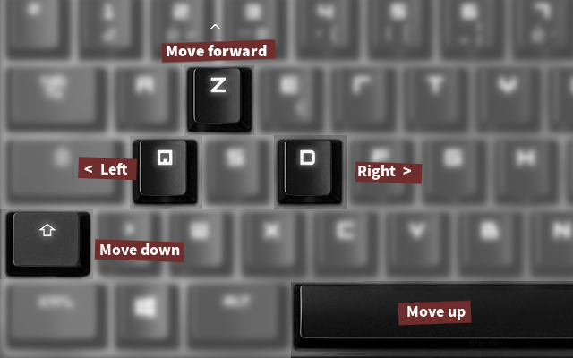

Quidditch (OpenGL project)
=========================
# About this project

## Game concept

This project is about making a Quidditch game (like in harry potter). Your goal is to catch the Golden Snithch. The arrow is here to help you as it points to the golden snitch.


## Team
  - Pierre Gabon
  - Julien Lepasquier
  - Vivien Tran-Ba
  - Yann Pellegrini
  - Pierrick Bouvier
  
  
# Building

**Note** : please read the "known bugs" section about the problem with textures and git.

```
mkdir build
cd build
cmake ..
make
```


# Playing

Requires OpenGL.

```
./Quidditch
```

## Controls



**Debug only** : P to freeze snitch, F to dump data, +/- to modify camera zoom


# Known bugs

**You must regenerate textures from the png/jpgs to tga (git corrupts them for some reason)**

use `convert -type TrueColor in.png out.tga` when you see the error "texture has incomplete image"


```
cd texture
convert -type TrueColor sky_texture.jpg sky_texture.tga
convert -type TrueColor gazon.jpg gazon.tga
convert -type TrueColor snitch.png snitch.tga
convert -type TrueColor tex_char.png tex_char.tga
convert -type TrueColor over.png over.tga
convert -type TrueColor arrow.png arrow.tga

```